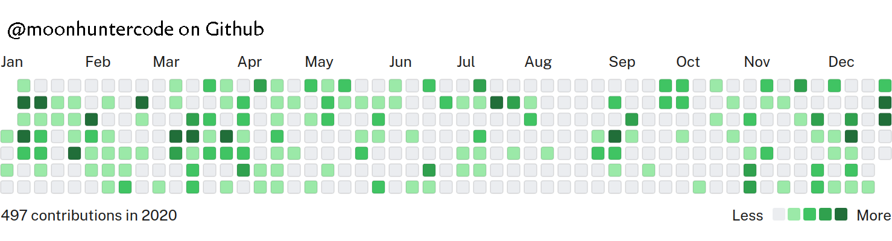

# 📅 Vanilla JS GitHub Calendar

[](https://www.npmjs.com/package/vanilla-js-github-calendar)
[](https://moonhuntercode.github.io/vanilla-js-github-calendar/)
[](https://opensource.org/licenses/MIT)

A lightweight, dependency-free Web Component that displays a GitHub contributions calendar (heatmap) for any user. Built with pure Vanilla JS, HTML5, and CSS3.

🚀 **[View the Live Demo!](https://moonhuntercode.github.io/vanilla-js-github-calendar/)**



## Features

- **No Dependencies**: Pure Vanilla JS Web Component (`<github-calendar>`).
- **Semantic HTML**: Built with accessible and clean HTML5 elements.
- **Mobile-First & Responsive**: Includes smooth touch horizontal scrolling for perfect display on phones.
- **Easy Customization**: Uses CSS Custom Properties for painless color themes (Purple, Blue, Dark Mode, etc.).
- **Vite Powered**: Blazing fast modern ESM tooling.

## Quick Start

### 1. Installation

```shell
npm install vanilla-js-github-calendar
```

### 2. Usage in HTML

Simply include the script and use the `<github-calendar>` HTML tag. No JavaScript configuration required!

```html
<head>
  <!-- 1. Include the external stylesheet -->
  <link rel="stylesheet" href="node_modules/vanilla-js-github-calendar/dist/vanilla-js-github-calendar.css">
</head>
<body>
  <!-- 2. Include the script (ESM) -->
  <script type="module" src="node_modules/vanilla-js-github-calendar/dist/vanilla-js-github-calendar.js"></script>

  <!-- 3. Add the custom element with your username -->
  <github-calendar username="moonhuntercode"></github-calendar>
</body>
```

## Documentation & Guides

We've designed this library to be incredibly beginner-friendly and robust. Please check out our dedicated guides:

- 📖 [Usage & Theming Guide](USAGE_AND_THEMING.md): Learn how to change colors, tooltips, and background themes effortlessly using pure CSS variables.
- 🎨 [Advanced Customization Guide](CUSTOMIZATION_GUIDE.md): Deep dive into how the component works internally, its semantic HTML structure, and how its Mobile-First responsive CSS works.
- 🏗️ [Architecture & Developer Experience (DX)](ARCHITECTURE_AND_DX.md): Learn about the Light DOM vs Shadow DOM, TypeScript typing, and Custom Events for error handling.
- 📏 [Advanced Layout & Browser Compatibility](ADVANCED_LAYOUT_AND_COMPATIBILITY.md): How to embed the calendar in Flex/Grid dashboards and the ES6+ browser support matrix.

## Development

Want to contribute or run the examples locally?

```shell
# 1. Install dependencies
npm install

# 2. Start the Vite dev server with interactive examples
npm run dev

# 3. Build the library
npm run build

# 4. Run tests
npm run test
```
